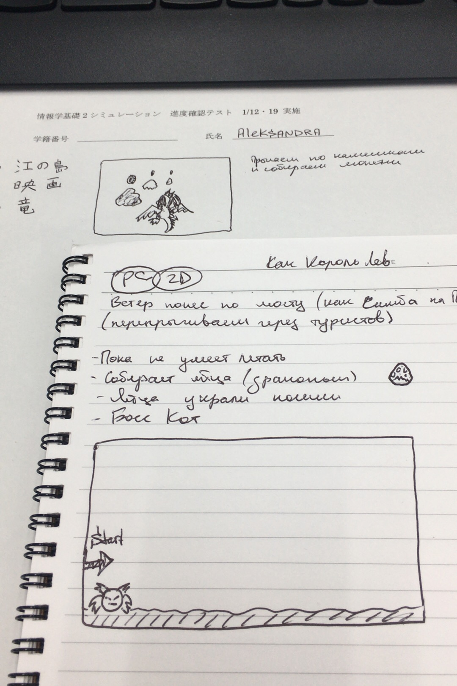

#画面イメージ

! [画面イメージ](image1.JPG)

タイトル　”Dragon Island”

# 操作方法
- キーボードの➡押したらキャラクターが動きます。
- SPACEでジャンプします。
- Aで火を出します。
- Sでスピードアップします。

# ターゲットデバイス (PC or スマートフォン)
PC2D

# ゲームのストーリー

# ルール　（レベル）
- ドラゴンがネコと戦う。ネコ火を出したらネコが逃げる。

# 利用したセットや素材の著作者、URL
- いらすとや. (URL)
  - 何が出来るのか？何ができないのか？
